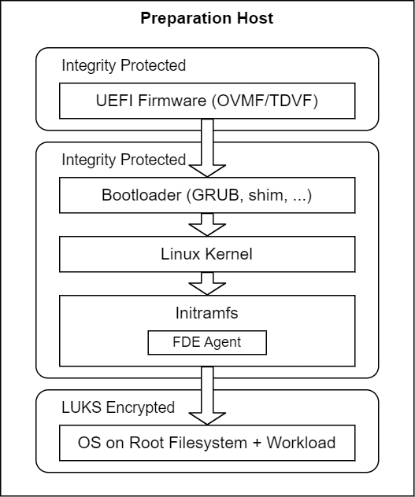
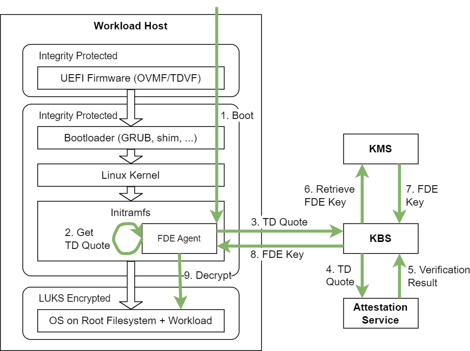

# Full Disk Encryption Solution for Intel TDX

In short, the goal of this solution is that a Workload Owner is able to protect all data and code of its workload in use and at rest.
The data in use protection is provided by putting the workload inside a VM protected by [Intel® Trust Domain Extensions (Intel® TDX)](https://www.intel.com/content/www/us/en/developer/articles/technical/intel-trust-domain-extensions.html), i.e., by Trust Domains (TDs).
The data at rest protection is provided by Full disk encryption (FDE), a security method for protecting sensitive data by encrypting all data on disk to prevent unauthorized access.

In the next section, we first provide more background in FDE and Intel TDX.
Next, we provide a high-level overview of the solution and the assumptions we have about the components making up the solution.
Afterwards, we provide a detailed flow of the setup and runtime phase.


## Background

### Full Disk Encryption (FDE)

Full disk encryption is a robust security measure for safeguarding the contents of digital storage devices, including hard drives, SSDs, and virtual disks for VMs, through seamless encryption.
This protective shield extends to applications, user files, and even the OS.
The core objective of FDE is to thwart unauthorized access to sensitive information, particularly in scenarios involving device theft, loss, or unauthorized physical access.

The mechanics of FDE involve the utilization of a cipher, typically a block cipher, to encrypt data at rest on the storage device.
To initiate the process, a user or device manufacturer must initialize the storage device by providing an encryption key or passphrase.
This action creates and writes a special metadata structure on the device, representing an initially empty state encrypted with the provided key.

Each time the system powers on or the device is accessed, a key or a passphrase is needed to decrypt and read or write data on the device.
This key is not stored on the device itself and must be provided for every use of the device.
It is typically cached in a volatile and protected memory area and erased when the device is no longer in use, or the system is shut down.

LUKS (Linux Unified Key Setup) is a disk encryption specification commonly used to implement Full Disk Encryption (FDE) on Linux systems.


### Intel® Trust Domain Extensions (Intel® TDX) Background

Intel® Trust Domain Extensions (Intel® TDX) is Intel's newest Confidential Computing technology.
This hardware-based Trusted Execution Environment (TEE) facilitates the deployment of Trust Domains (TD), which are hardware-isolated virtual machines (VM) designed to protect sensitive data and applications from unauthorized access.

One main feature of Intel TDX is remote attestation.
At its core, remote attestation is a process used by software to demonstrate to a remote party that the software has been properly instantiated on a platform.
Intel TDX attestation allows a remote party to ensure that a Virtual Machine (VM) is using Intel TDX for hardware-isolation and protection, as well as ensuring all components of the Intel TDX Trusted Compute Base (TCB) are up to date (or at an expected level).

The base piece of information used for Intel TDX remote attestation is called a quote, or more explicitly for Intel TDX, a TD Quote.
A TD Quote is a cryptographic attestation, or secure proof, generated by Intel TDX hardware to prove the authenticity and state of a Trust Domain (TD).

For more details, see [Intel's Intel TDX page](https://www.intel.com/content/www/us/en/developer/tools/trust-domain-extensions/overview.html) and the [Intel® TDX Enabling Guide](https://cc-enabling.trustedservices.intel.com/intel-tdx-enabling-guide/01/introduction/).


## High-level Overview of FDE + Intel TDX

On this page, we describe one possibility on how to combine FDE with Intel TDX.
The process splits into a preparation phase and a runtime phase.

Overall, the following components play a role in the two phases:
- A "Preparation Host" that the Workload Owner uses to prepare a UEFI firmware and TD image containing its workload.
    The Preparation host does not require Intel TDX support.
- A "Workload Host" that starts a TD based on the prepared UEFI firmware and TD image.
    The Workload Host requires Intel TDX support.
- A "Key Management Service (KMS)" for securely storing the key used for FDE.
- An "Attestation Service" responsible to verify a TD Quote.
- A "Key Broker Service (KBS)" responsible for accepting a TD Quote, forwarding the TD Quote to the Attestation Service for quote verification, requesting the key used for FDE from the KMS, and securely return the key into the TD.

We do not make any assumption where exactly all the individual components are deployed - the components might run on the same physical machine, some components might be co-located, or each might be on a separate machine.

The only important restriction is that the Workload Owner fully trusts the environment(s) containing the Preparation Host, the KMS, the KBS, and the Attestation Service.
Conversely, the Workload Owner does not have to trust the environment containing the Workload Host.


### Preparation Phase

The preparation phase involves multiple tasks:
1. Setup a Workload Host.
2. Setup a KMS.
3. Setup a KBS.
4. Prepare UEFI Firmware and TD image on Preparation Host and Workload Host.

The first three steps are rather self-describing and we refer for later sections for details.
The fourth step is elaborate in itself and we want to present a few details here.
The goal of this task is to prepare a UEFI firmware (e.g., OVMF or TDVF) and a TD image.
The UEFI firmware must be enabled for Intel TDX and its integrity is protected by remote attestation.
The TD image contains a bootloader, a Linux kernel, initramfs with an "FDE Agent", and a root filesystem partition with the OS and workload.
The Workload Owner generates a key, encrypts the root filesystem with this key using LUKS2, and stores the key in the KMS.
All other pieces of the TD image are integrity protected by remote attestation.

The following figure shows result of the preparation and the boot flow of the components:



### Runtime Phase

On a high level, the following is done during the runtime phase, which is also visualized in the next figure:
1. Boot the TD until initramfs.
2. Initramfs starts the FDE Agent, which requests a TD Quote (i.e., attestation evidence) from hardware.
3. FDE Agent sends the TD Quote to the KBS.
4. KBS forwards the TD Quote to the Attestation Service.
5. Attestation Service performs quote verification and returns the verification result.
6. KBS requests the FDE key matching the TD from the KMS.
7. KMS returns the FDE key matching the TD to the KBS.
8. KBS securely sends back the FDE key to the FDE Agent.
9. FDE Agent decrypts root filesystem partition.




## Detailed Recipe for FDE + Intel TDX

For this detailed recipe of our solution, we assume that [HashiCorp Vault](https://www.hashicorp.com/de/products/vault) is used as KMS, [Trustee's Attestation Service](https://github.com/confidential-containers/trustee/tree/v0.15.0/attestation-service) is used as Attestation Service (AS), and [Trustee's Key Broker Service](https://github.com/confidential-containers/trustee/tree/v0.15.0/kbs) is used as Key Broker Service (KBS).
As mentioned before, we do not make any assumption where exactly all the individual components are deployed - the components might run on the same physical machine, some components might be co-located, or each might be on a separate machine.

For ease of explanation in this recipe, **we assume that all components are deployed on the same physical machine**.
Please adjust the commands according to your environment.

> [!NOTE]
> The TD image using FDE currently only supports Ubuntu 24.04, which is also used as the host OS throughout this recipe.

### Preparation Phase

#### Setup Workload Host

1. Verify that supported hardware is used following the [Supported Hardware section](https://github.com/canonical/tdx/tree/3.1?tab=readme-ov-file#3-supported-hardware) of Canonical's guide.
2. Setup the host OS and BIOS settings following the [Setup Host OS section](https://github.com/canonical/tdx/tree/3.1?tab=readme-ov-file#4-setup-host-os) of Canonical's guide.
3. Setup remote attestation and register your platform according to the [Setup Intel® SGX Data Center Attestation Primitives (Intel® SGX DCAP) on the Host OS section](https://github.com/canonical/tdx/tree/3.1?tab=readme-ov-file#82-setup-intel-sgx-data-center-attestation-primitives-intel-sgx-dcap-on-the-host-os) of Canonical's guide.

#### Prerequisites for KMS, AS, and KBS

1. Install Docker and enable it for non-root users:
    ```
    curl -fsSL https://get.docker.com -o get-docker.sh
    sudo sh get-docker.sh
    sudo usermod -aG docker $USER
    newgrp docker
    ```
    See [Docker's installation documentation](https://docs.docker.com/engine/install/ubuntu/) for more detailed information.

2. Create a Docker network for Trustee services to communicate:
    ```
    docker network create trustee-net
    ```

3. Download FDE solution and move into its directory:
    ```
    git clone --recurse-submodules https://github.com/intel/confidential-computing.tee.tools.git fde
    pushd fde/full-disk-encryption/
    ```

    > NOTE: This will also clone Trustee's repository with tag `v0.15.0` and Canonical's Intel TDX repository with tag `3.1` inside `full-disk-encryption` directory.

4. Create configuration directory for Trustee's AS and KBS:
    ```
    mkdir -p trustee/config-data/reference-values/
    ```

5. Set system IP and configure proxy settings for Docker:
    ```
    SYSTEM_IP=$(hostname -I | awk '{print $1}')
    export NO_PROXY=${SYSTEM_IP},trustee-as,trustee-kbs,trustee-vault
    ```

6. Create a file about the KMS, AS, and KBS setup configuration:
    ```
    SETUP_CONFIG_FILE=$PWD/setup_config.sh
    cat > "$SETUP_CONFIG_FILE" <<EOF
    #!/bin/bash

    SETUP_CONFIG_FILE="$SETUP_CONFIG_FILE"
    export NO_PROXY="$NO_PROXY"
    SYSTEM_IP="$SYSTEM_IP"
    VAULT_ROOT_TOKEN=
    KBS_PORT=
    KBS_URL=
    KBS_CERT_PATH=
    SK_KBS_ADMIN=
    EOF
    ```

    This file can be used to conveniently continue the setup after a machine reboot or when a new terminal is used.

#### Setup HashiCorp Vault as a KMS

1. Create a 128bit, random root token for Vault and start Vault in development mode:
    ```
    VAULT_ROOT_TOKEN=$(openssl rand -hex 16)

    docker run -d \
        --name trustee-vault \
        --network trustee-net \
        --restart unless-stopped \
        -e VAULT_DEV_ROOT_TOKEN_ID="$VAULT_ROOT_TOKEN" \
        -e VAULT_DEV_LISTEN_ADDRESS=0.0.0.0:8200 \
        -e VAULT_ADDR=http://127.0.0.1:8200 \
        -e VAULT_TOKEN="$VAULT_ROOT_TOKEN" \
        -e no_proxy="$NO_PROXY" \
        --cap-add=IPC_LOCK \
        hashicorp/vault:1.20 \
        sh -c "docker-entrypoint.sh server -dev & until vault status >/dev/null 2>&1; do sleep 1; done; vault secrets enable -version=1 -path=keybroker kv 2>/dev/null || true && wait"
    ```
    > NOTE: Development mode should only be used in a development environment - not in production.
    > In development mode, all data is only stored in memory and thus all secrets are gone on reboot.
    > Follow the instructions provided by HashiCorp for a production setup.

    > NOTE: If the service runs behind a proxy, use the following additional options in the `docker run` (after adjusting according to your proxy setup): `-e http_proxy="<HTTP proxy>` and `-e https_proxy="<HTTPS proxy>"`.

    > NOTE: Above command will also enable a [key-value secret engine](https://developer.hashicorp.com/vault/docs/v1.18.x/secrets/kv) inside Vault at path `keybroker`.

2. Add important Vault settings to setup configuration file:
    ```
    sed -i "/^VAULT_ROOT_TOKEN=/c\\VAULT_ROOT_TOKEN=\"${VAULT_ROOT_TOKEN}\"" "$SETUP_CONFIG_FILE"
    ```

#### Setup Trustee's Attestation Service as AS:

1. Move into of Trustee directory:
    ```
    pushd trustee/
    ```

2. Pin DCAP packages to version 1.23 in the Attestation Service Dockerfile:
    ```
    sed -i \
        -e 's|ubuntu jammy main|ubuntu noble main|g' \
        -e '/intel-sgx\.list.*&& \\/a\    curl -sSLf https://download.01.org/intel-sgx/sgx_repo/ubuntu/apt_preference_files/99sgx_2_26_100_noble_custom_version.cfg | tee -a /etc/apt/preferences.d/99sgx_sdk && \\' \
        attestation-service/docker/as-grpc/Dockerfile
    ```

3. Build Docker image of AS:
    ```
    docker build \
        --build-arg no_proxy="$NO_PROXY" \
        --ulimit nofile=90000:90000 \
        -f attestation-service/docker/as-grpc/Dockerfile \
        -t trustee-as:latest .
    ```

    > NOTE: If the service runs behind a proxy, use the following additional options in the `docker build` (after adjusting according to your proxy setup): `--build-arg http_proxy="<HTTP proxy>` and `--build-arg https_proxy="<HTTPS proxy>"`.

4. Create a configuration file for AS:
    ```
    cat > config-data/as-config.json <<EOF
    {
        "policy_engine": "opa",
        "rvps_config": {
            "type": "BuiltIn",
            "storage": {
                "type": "LocalFs",
                "file_path": "/opt/attestation-service/reference-values"
            }
        },
        "attestation_token_broker": {
            "type": "Ear",
            "duration_min": 5
        }
    }
    EOF
    ```

5. Start AS:
    ```
    docker run -d \
        --name trustee-as \
        --network trustee-net \
        --restart unless-stopped \
        --ulimit nofile=90000:90000 \
        -v "$(pwd)/config-data/as-config.json:/opt/attestation-service/config.json:ro" \
        -v "$(pwd)/config-data/reference-values:/opt/attestation-service/reference-values" \
        -v "$(pwd)/attestation-service/docs/sgx_default_qcnl.conf:/etc/sgx_default_qcnl.conf:ro" \
        -e no_proxy="$NO_PROXY" \
        trustee-as:latest \
        grpc-as --config-file /opt/attestation-service/config.json --socket 0.0.0.0:3000
    ```

    > NOTE: Use `-e RUST_LOG=debug` with above command for more detailed logs.

    > NOTE: If the service runs behind a proxy, use the following additional options in the `docker run` (after adjusting according to your proxy setup): `-e http_proxy="<HTTP proxy>` and `-e https_proxy="<HTTPS proxy>"`.

6. Move out of Trustee directory:
    ```
    popd
    ```

7. Verify AS deployment by checking its Docker logs:
    ```
    docker logs trustee-as
    ```
    The log entry is expected to contain:
    ```
    [<date and time> INFO  grpc_as] CoCo AS:
    v0.1.0
    commit:
    buildtime: <date and time> +00:00
    [<date and time> INFO  grpc_as::grpc] Starting gRPC Attestation Service. Listening on socket: 0.0.0.0:3000
    [<date and time> INFO  attestation_service::rvps] launch a built-in RVPS.
    [<date and time> WARN  reference_value_provider_service::extractors] No configuration for SWID extractor provided. Default will be used.
    [<date and time> INFO  attestation_service::token::ear_broker] No Token Signer key in config file, create an ephemeral key and without CA pubkey cert
    ```

#### Setup Trustee's Key Broker Service as KBS:

1. Move into of Trustee directory:
    ```
    pushd trustee/
    ```

2. Add Vault support in Dockerfile of KBS:
    ```
    sed -i "s/make AS_FEATURE=coco-as-grpc/make background-check-kbs VAULT=true AS_FEATURE=coco-as-grpc/" kbs/docker/coco-as-grpc/Dockerfile
    ```

3. Build Docker image of KBS:
    ```
    docker build \
        --build-arg no_proxy="$NO_PROXY" \
        --ulimit nofile=90000:90000 \
        -f kbs/docker/coco-as-grpc/Dockerfile \
        -t trustee-kbs:latest .
    ```

    > NOTE: If the service runs behind a proxy, use the following additional options in the `docker build` (after adjusting according to your proxy setup): `--build-arg http_proxy="<HTTP proxy>` and `--build-arg https_proxy="<HTTPS proxy>"`.

4. Generate self-signed certificate used for HTTPS communication with KBS:

    > NOTE: The self-signed certificate generated by these instructions is intended **for demo and testing purposes only**.
    > It is inherently insecure and **MUST NOT be used in a production environment**.
    > For production deployments, you must use a certificate issued by a trusted root Certificate Authority (CA) to ensure secure communication.

    - Move into Trustee configuration folder:
        ```
        pushd config-data/
        ```
    - Create certificate configuration - adjust to your needs:
        ```
        cat > cert.conf <<EOF
        [req]
        default_bits = 3072
        default_md = sha256
        distinguished_name = req_distinguished_name
        req_extensions = req_ext
        x509_extensions = v3_ca
        [req_distinguished_name]
        countryName = Country Name (2 letter code)
        countryName_default = US
        stateOrProvinceName = State or Province Name (full name)
        stateOrProvinceName_default = CA
        localityName = Locality Name (eg, city)
        localityName_default = San Francisco
        organizationName  = Organization Name (eg, company)
        organizationName_default = Organization
        organizationalUnitName = organizationalunit
        organizationalUnitName_default = Development
        commonName = Common Name (e.g. server FQDN or YOUR name)
        commonName_default = localhost
        commonName_max = 64
        [req_ext]
        subjectAltName = @alt_names
        [v3_ca]
        subjectAltName = @alt_names
        [alt_names]
        IP.1 = $SYSTEM_IP
        EOF
        ```
    - Generate self-signed certificate and its private key, and adjust the permission of these files:
        ```
        openssl req -x509 -nodes -days 365 -newkey rsa:3072 \
          -keyout kbs.key.pem -out kbs.cert.pem \
          -config cert.conf -batch

        chmod 600 kbs.key.pem
        chmod 644 kbs.cert.pem
        ```
    - Move out of Trustee configuration folder:
        ```
        popd
        ```

5.  Generate asymmetric key pair (SK<sub>KBS</sub>/PK<sub>KBS</sub>) used for administrator access to KBS.
    ```
    pushd config-data/

    openssl genpkey -algorithm ed25519 > sk_kbs_admin.pem
    openssl pkey -in sk_kbs_admin.pem -pubout -out pk_kbs_admin.pem

    chmod 600 sk_kbs_admin.pem
    chmod 644 pk_kbs_admin.pem

    popd
    ```

6. Set important settings of AS to environment variable and add them to setup configuration file:
    ```
    KBS_PORT=8080
    KBS_URL="https://${SYSTEM_IP}:${KBS_PORT}"
    KBS_CERT_PATH="$PWD/config-data/kbs.cert.pem"
    SK_KBS_ADMIN="$PWD/config-data/sk_kbs_admin.pem"

    sed -i "/^KBS_PORT=/c\\KBS_PORT=\"${KBS_PORT}\"" "$SETUP_CONFIG_FILE"
    sed -i "/^KBS_URL=/c\\KBS_URL=\"${KBS_URL}\"" "$SETUP_CONFIG_FILE"
    sed -i "/^KBS_CERT_PATH=/c\\KBS_CERT_PATH=\"${KBS_CERT_PATH}\"" "$SETUP_CONFIG_FILE"
    sed -i "/^SK_KBS_ADMIN=/c\\SK_KBS_ADMIN=\"${SK_KBS_ADMIN}\"" "$SETUP_CONFIG_FILE"
    ```

7. Create a configuration file for KBS:
    ```
    cat > config-data/kbs-config.toml <<EOF
    [http_server]
    sockets = ["0.0.0.0:8080"]
    private_key = "/opt/kbs/certs/kbs.key.pem"
    certificate = "/opt/kbs/certs/kbs.cert.pem"
    insecure_http = false

    [attestation_token]
    insecure_key = true

    [attestation_service]
    type = "coco_as_grpc"
    as_addr = "http://trustee-as:3000"
    policy_engine = "opa"

    [attestation_service.attestation_token_broker]
    type = "Ear"
    duration_min = 5

    [attestation_service.rvps_config]
    type = "BuiltIn"

    [admin]
    auth_public_key = "/opt/kbs/certs/pk_kbs_admin.pem"

    [[plugins]]
    name = "resource"
    type = "Vault"
    vault_url = "http://trustee-vault:8200"
    token = "$VAULT_ROOT_TOKEN"
    mount_path = "keybroker"
    kv_version = 1
    EOF
    ```

8. Start KBS:
    ```
    docker run -d \
        --name trustee-kbs \
        --network trustee-net \
        --restart unless-stopped \
        --ulimit nofile=90000:90000 \
        -p $KBS_PORT:8080 \
        -v "$(pwd)/config-data/kbs-config.toml:/opt/kbs/kbs-config.toml:ro" \
        -v "$(pwd)/config-data/kbs.cert.pem:/opt/kbs/certs/kbs.cert.pem:ro" \
        -v "$(pwd)/config-data/kbs.key.pem:/opt/kbs/certs/kbs.key.pem:ro" \
        -v "$(pwd)/config-data/pk_kbs_admin.pem:/opt/kbs/certs/pk_kbs_admin.pem:ro" \
        -e no_proxy="$NO_PROXY" \
        trustee-kbs:latest \
        kbs --config-file /opt/kbs/kbs-config.toml
    ```
    > NOTE: Use `-e RUST_LOG=debug` with above command for more detailed logs.

9. Move out of Trustee directory:
    ```
    popd
    ```

10. Verify KBS deployment by checking Docker logs:
    ```
    docker logs trustee-kbs
    ```
    The log entry is expected to contain:
    ```
    [<date and time> INFO  kbs] Using config file /opt/kbs/kbs-config.toml
    [<date and time> INFO  tracing::span] new;
    [<date and time> WARN  vaultrs::client] Disabling TLS verification
    [<date and time> INFO  kbs::attestation::coco::grpc] connect to remote AS [http://trustee-as:3000] with pool size 100
    [<date and time> INFO  kbs::api_server] Starting HTTPS server at [0.0.0.0:8080]
    [<date and time> INFO  actix_server::builder] starting 256 workers
    [<date and time> INFO  actix_server::server] Actix runtime found; starting in Actix runtime
    [<date and time> INFO  actix_server::server] starting service: "actix-web-service-0.0.0.0:8080", workers: 256, listening on: 0.0.0.0:8080
    ```

#### Prepare UEFI Firmware and TD image on Preparation Host and Workload Host.

1. [**On Preparation Host**] Install dependencies for FDE Binaries:
    - Set up the appropriate Intel SGX package repository:
        ```
        echo 'deb [signed-by=/etc/apt/keyrings/intel-sgx-keyring.asc arch=amd64] https://download.01.org/intel-sgx/sgx_repo/ubuntu noble main' | sudo tee /etc/apt/sources.list.d/intel-sgx.list
        wget https://download.01.org/intel-sgx/sgx_repo/ubuntu/intel-sgx-deb.key
        sudo mkdir -p /etc/apt/keyrings
        cat intel-sgx-deb.key | sudo tee /etc/apt/keyrings/intel-sgx-keyring.asc > /dev/null
        sudo apt-get update
        ```
    - Install the required packages:
        ```
        sudo apt update && sudo apt install -y --allow-downgrades \
            pkg-config gpg wget openssl libcryptsetup-dev python3-venv \
            libtdx-attest-dev qemu-system-x86 libtss2-dev build-essential
        ```
    - Install Rust, activate Rust in current shell, and test Rust installation:
        ```
        curl --proto '=https' --tlsv1.2 -sSf https://sh.rustup.rs | sh
        . "$HOME/.cargo/env"
        cargo --version
        ```
        See [Rust's installation documentation](https://www.rust-lang.org/tools/install) for more detailed information.

2. [On Preparation Host] Download FDE solution and move into its directory:
    ```
    git clone --recurse-submodules https://github.com/intel/confidential-computing.tee.tools.git fde
    pushd fde/full-disk-encryption/
    ```

    > NOTE: This will also clone Trustee's repository with tag `v0.15.0` and Canonical's Intel TDX repository with tag `3.1` inside `full-disk-encryption` directory.

3. [On Preparation Host] Build FDE Binaries:
    ```
    cargo build --release --manifest-path fde-binaries/Cargo.toml
    ```

    > NOTE: If the build fails with error `error: failed to add native library /lib/x86_64-linux-gnu/libm.a: file too small to be an archive` or `error: failed to add native library /lib/x86_64-linux-gnu/libm.a: Unsupported archive identifier`, please execute below workaround and re-build:
    > ```
    > sudo ln -f /lib/x86_64-linux-gnu/libm-2.39.a /lib/x86_64-linux-gnu/libm.a
    > ```

4. [On Preparation Host] Generate root filesystem encryption key (k<sub>RFS</sub>) and corresponding key id (ID<sub>K_RFS</sub>).
    ```
    k_RFS=$(openssl rand -hex 64)
    ID_K_RFS="keybroker/key/$(openssl rand -hex 32)"
    ```

    > NOTE: We first do the encryption with a dummy key, but we already have to enroll the final key ID into the OVMF image used for the dummy encryption.

    - Optionally, use the following command to check the uniqueness of the key id (ID<sub>K_RFS</sub>) in KMS.
        ```
        docker exec -e VAULT_ADDR="http://127.0.0.1:8200" -e VAULT_TOKEN="$VAULT_ROOT_TOKEN" trustee-vault \
            vault kv get -mount=keybroker $ID_K_RFS
        ```

        The output `No value found at keybroker/<key-id>` indicates that the specified key id does not exist in the keybroker path and is therefore unused.
        For any other result, generate another key id to prevent that an existing key is overwritten.

5. [On Preparation Host] Create TD image TD<sub>W</sub> with workload, a dummy key used for FDE:
    - Activate automatic attestation packages installation inside of the image:
        ```
        sed -i "s/^TDX_SETUP_ATTESTATION=0$/TDX_SETUP_ATTESTATION=1/" canonical-tdx/setup-tdx-config
        ```

    - Create TD base image (TD<sub>B</sub>) with your workload.
        - Start with Ubuntu 24.04 as a base image:
            ```
            pushd canonical-tdx/guest-tools/image
            sudo ./create-td-image.sh -v 24.04
            popd
            ```
            > NOTE: If you're behind a proxy, use `sudo -E` to preserve user environment.

            The configuration of the `create-td-image.sh` script can be adjusted in the configuration file `canonical-tdx/setup-tdx-config`.
            Additionally, the file `canonical-tdx/guest-tools/image/setup.sh` contains information about installation steps executed inside the TD image.

            The resulting image will be generated at `canonical-tdx/guest-tools/image/tdx-guest-ubuntu-24.04-generic.qcow2`.
        - Enrich the Ubuntu 24.04 base image with the workload you want to be contained.
            For example, `virt-customize` can be used for this adjustment.

    - Create directory for image-related data:
        ```
        mkdir data
        ```

    - Create dummy key used for initial FDE:
        ```
        openssl rand -hex 64 > data/tmp_k_rfs
        ```

    - Download and extracts OVMF:
        ```
        wget https://launchpad.net/~kobuk-team/+archive/ubuntu/tdx-release/+files/ovmf_2024.02-3+tdx1.0_all.deb -P data/
        dpkg-deb -x data/ovmf_*.deb data/ovmf-extracted
        ```

    - Using the (enriched) base image TD<sub>B</sub>, create a dummy TD image TD<sub>W</sub> that is used to retrieve a TD Quote:
        ```
        sudo tools/image/fde-encrypt_image.sh GET_QUOTE \
            -p $PWD/canonical-tdx/guest-tools/image/tdx-guest-ubuntu-24.04-generic.qcow2 \
            -e $PWD/tools/image/tdx-guest-ubuntu-24.04-encrypted.img \
            -d $PWD/data/tmp_k_rfs \
            -c $KBS_CERT_PATH \
            -i $ID_K_RFS \
            -u $KBS_URL
        ```

        > NOTE: The dummy TD image TD<sub>W</sub> requires enough disk space for the following pieces: (1) space for data from the (enriched) base image TD<sub>B</sub>, (2) space for data generated at runtime, and (3) space for encryption overhead of approximately 1GB.
        > By default, we allocate 10GB for the root filesystem partition, 2GB for the boot partition, and 101MB for BIOS/EFI resulting in of total image size of approximately 12GB.
        > The size of the root filesystem and boot partitions can be adjusted via command line attributes during the `fde-encrypt_image.sh` invocation.
        > See `sudo tools/image/fde-encrypt_image.sh -h` for more details.

        In more detail, this script:
        - creates a completely new TD image with multiple partitions,
        - creates a LUKS2 encrypted partition using the provided dummy key,
        - formats the partitions,
        - fills the encrypted partition with data from the base image TD<sub>B</sub> and FDE binaries,
        - enrolls the KBS URL and the key ID (ID<sub>K_RFS</sub>) corresponding to root filesystem encryption key (k<sub>RFS</sub>) into an OVMF image.

        In a later step, the dummy key for the LUKS2 partition is replaced by actual key.

        Script will print the updated OVMF file path and the updated encrypted image path.

        Example output:
        ```
        =============== Created Files ================
        OVMF_PATH: <Path to updated OVMF file>
        IMAGE_PATH: <Path to encrypted image file>
        ```

6. [**On Workload Host**] Download FDE solution and move into its directory:
    ```
    git clone --recurse-submodules https://github.com/intel/confidential-computing.tee.tools.git fde
    pushd fde/full-disk-encryption/
    ```

    > NOTE: This will also clone Trustee's repository with tag `v0.15.0` and Canonical's Intel TDX repository with tag `3.1` inside `full-disk-encryption` directory.

7. [On Workload Host] Patch the TD launch script:
    ```
    git -C canonical-tdx apply ../patches/run_td_sh.patch
    ```

8. [On Workload Host] Boot TD<sub>W</sub> combined with the OVMF image `OVMF_FDE.fd`.
    Make sure the respective TD image and OVMF binaries are copied to Workload Host and the paths match the following command:
    ```
    TD_IMG=tools/image/tdx-guest-ubuntu-24.04-encrypted.img \
        canonical-tdx/guest-tools/run_td.sh \
        -d false \
        -f tools/image/OVMF_FDE.fd
    ```

    During boot, FDE Agent retrieves a TD Quote, prints the TD Quote in an export command, and stops further boot.
    Example output:
    ```
    ---------------------------------------------------------
    export QUOTE=<base64 encoded TD quote>
    ---------------------------------------------------------
    Stop further boot in GET_QUOTE boot mode
    Rebooting automatically due to panic= boot argument
    [   10.122423] ACPI: PM: Preparing to enter system sleep state S5
    [   10.123502] reboot: Restarting system
    [   10.124028] reboot: machine restart
    qemu-system-x86_64: cpus are not resettable, terminating
    ```

    > NOTE: "panic=1" is used by the FDE Agent to kill the TD on every error.
    > This is an important security feature for production systems, but you might want to remove it during debug sessions.

9. [**On Preparation Host**] Export TD Quote returned by last command:
    ```
    export QUOTE=<base64 encoded TD quote>
    ```

10. [On Preparation Host] Send TD attributes from the TD Quote of TD<sub>W</sub>, the root filesystem encryption key (k<sub>RFS</sub>), and key id (ID<sub>K_RFS</sub>) to KBS:
    ```
    ./fde-binaries/target/release/fde-kbs-store-key \
        --sk-kbs-admin-path $SK_KBS_ADMIN \
        --kbs-url $KBS_URL \
        --kbs-cert-path $KBS_CERT_PATH \
        --quote-b64 $QUOTE \
        --k-rfs-id $ID_K_RFS \
        --k-rfs $k_RFS
    ```

    In more detail, this script:
    - extracts TD attributes `MRSEAM`, `MRSIGNERSEAM`, `SEAMSVN`, `MRTD`, `RTMR0`, `RTMR1`, and `RTMR3` from passed TD Quote,
    - uses SK<sub>KBS</sub> key for administrator access to Trustee KBS,
    - based on the extracted TD attributes, generates an attestation policy for AS and a resource policy for KBS, which are later uses to validate key retrieval request,
    - sends the root filesystem encryption key (k<sub>RFS</sub>) and corresponding key id (ID<sub>K_RFS</sub>) to KBS, which stores the key k<sub>RFS</sub> in the KMS with id ID<sub>K_RFS</sub>.

11. [On Preparation Host] Re-encrypt TD<sub>W</sub> with the root filesystem encryption key (k<sub>RFS</sub>) and update GRUB configuration to boot in TD boot mode `TD_FDE_BOOT`:
    ```
    sudo tools/image/fde-encrypt_image.sh TD_FDE_BOOT \
        -p $PWD/tools/image/tdx-guest-ubuntu-24.04-encrypted.img \
        -e $PWD/tools/image/tdx-guest-ubuntu-24.04-encrypted.img \
        -d $PWD/data/tmp_k_rfs \
        -k $k_RFS
    ```

    In more detail, this script:
    - re-encrypts the root filesystem partition using the generated root file system encryption key (k<sub>RFS</sub>), replacing the initial dummy key,
    - changes the TD boot mode in the GRUB kernel command line,
    - prints the path of the unchanged OVMF file and the path of the re-encrypted image.

    Example output:
    ```
    =============== Created Files ================
    OVMF_PATH: <Path to OVMF file> (unchanged)
    IMAGE_PATH: <Path to encrypted image file>
    ```

## Runtime Phase

1. [**On Workload Host**] Boot TD<sub>W</sub> combined with the OVMF image `OVMF_FDE.fd`.

    Make sure the respective TD image and OVMF binaries are copied to Workload Host and the paths match the following command:
    ```
    TD_IMG=tools/image/tdx-guest-ubuntu-24.04-encrypted.img canonical-tdx/guest-tools/run_td.sh \
        -d false \
        -f tools/image/OVMF_FDE.fd
    ```

    During the TD boot, the FDE Agent in initramfs performs the following steps:
    - extracts Trustee KBS URL and key id (ID<sub>K_RFS</sub>) corresponding to root filesystem encryption key (k<sub>RFS</sub>) from OVMF image,
    - generates a random asymmetric key pair (SK<sub>TEE</sub>/PK<sub>TEE</sub>) used for key retrieval from Trustee KBS,
    - sends an authentication request to Trustee KBS,
    - receives a nonce-based challenge from from Trustee KBS,
    - requests a TD Quote using a hash of the nonce and PK<sub>TEE</sub> as report data,
    - sends the TD Quote, nonce, and PK<sub>TEE</sub> to Trustee KBS,
    - receives an attestation token from Trustee KBS after quote verification by Attestation Service,
    - requests resource ID<sub>K_RFS</sub> from Trustee KBS,
    - receives encrypted root filesystem encryption key (k<sub>RFS</sub>) from Trustee KBS,
    - decrypts the encrypted root filesystem encryption key (k<sub>RFS</sub>) using SK<sub>TEE</sub>,
    - decrypts root filesystem partition using k<sub>RFS</sub>,
    - securely erases k<sub>RFS</sub> from memory,
    - continues boot process to root filesystem.

    The Trustee KBS performs the following steps:
    - validates the authentication request from FDE Agent,
    - generates a random nonce to ensure attestation freshness,
    - returns the nonce and session_id to FDE Agent,
    - receives TD Quote, nonce, and PK<sub>TEE</sub> from FDE Agent,
    - verifies that the report data in TD Quote matches a hash of the received nonce and PK<sub>TEE</sub>
    - forwards the TD Quote to Trustee's Attestation Service, which validates it against the attestation policy,
    - receives an EAR attestation token from Attestation Service containing trust claims (hardware, configuration assessments),
    - verifies the attestation token and evaluates the resource policy against the trust claims and TD measurements,
    - returns attestation token to FDE Agent,
    - retrieves the root filesystem encryption key (k<sub>RFS</sub>) from HashiCorp Vault at path matching ID<sub>K_RFS</sub>,
    - encrypts k<sub>RFS</sub> with PK<sub>TEE</sub>,
    - returns the encrypted key to FDE Agent.

2. [On Workload Host] Verify the encryption status by running the below command in the booted TD<sub>W</sub>:
    ```
    blkid
    ```

    The TYPE of encrypted partition should be `crypto_LUKS` as shown in the below sample output:
    ```
    /dev/vda1: UUID="57d673b1-0ad7-48fd-b442-e889786de176" LABEL="rootfs-enc_0da0ffcd" TYPE="crypto_LUKS"
    ```

3. [**On Preparation Host**] Optionally, cleanup all the files and key generated during the preparation of your TD image and Trustee setup.
    ```
    rm -rf data/
    rm -rf trustee/config-data/
    ```

## Limitations

- The integrity of the actual workload is not protected.
- The integrity of the components measured in RTMR2 are not protected.
- Only QEMU-based boot using Canonical's `run_td.sh` is supported at the moment.
    This script does only support one TD at a time.
- Trustee KBS and HashiCorp Vault (KMS) currently don't communicate over a secure channel.
- HashiCorp Vault will loose all root filesystem encryption keys on reboot as it runs in development environment.
    Follow the instructions provided by HashiCorp for a production setup that is able to persistently store these keys.

## Troubleshooting

- After a machine reboot, Trustee KBS, Attestation service, and HashiCorp Vault should automatically restart.
    Verify the services are running:
    ```
    docker ps --filter name=trustee
    ```
    You should see three running containers: `trustee-kbs`, `trustee-as`, and `trustee-vault`.

- To restart the containers manually, run below commands:
    ```
    docker restart trustee-kbs
    docker restart trustee-as
    docker restart trustee-vault
    ```

- After opening a new terminal session or after a machine reboot, move into directory of FDE project and setup configuration settings:
    ```
    cd <folder of cloned repository>/full-disk-encryption/
    source setup_config.sh
    ```

- If you see certificate errors during FDE operations, verify the certificate path:
    ```
    ls -la $KBS_CERT_PATH
    ```

- Check logs of the services running to see any failure
    ```
    docker logs -f trustee-as --tail 50
    docker logs -f trustee-kbs --tail 50
    docker logs -f trustee-vault --tail 50
    ```

- If the Docker image build process for Trustee's Attestation Service or Trustee's Key Broker Service fails, please follow these steps:
    1. Verify proxy-related environment variables (e.g., `http_proxy`, `https_proxy`, `no_proxy`) are correctly set.
    2. Check Docker proxy settings at `/etc/systemd/system/docker.service.d/http-proxy.conf`

- If you see an error like `chown: invalid group: 'username:username'` when running `fde-encrypt_image.sh`, this means your user doesn't have a matching group name.
    Create a group with your username:
    ```
    sudo groupadd $(whoami)
    sudo usermod -aG $(whoami) $(whoami)
    ```
    Verify the group:
    ```
    id
    ```
    It should show similar output as `uid=1000(username) gid=1000(username) groups=1000(username),...`.

- After a machine reboot, HashiCorp Vault, and Intel PCCS might be shutdown.
    Please verify that these services are up and running.
    If you want to reboot Vault with the old `VAULT_ROOT_TOKEN`, remember that it is present in the setup configuration file (`<folder of cloned repository>/full-disk-encryption/setup_config.sh`).

- Storing key with `fde-kbs-store-key` fails with following error:
    ```
    thread 'main' (3391207) panicked at src/fde-kbs-store-key.rs:73:77:
    Failed to create root file key: Failed to store root filesystem encryption key, Status: 401 Unauthorized, Error: {"type":"https://github.com/confidential-containers/kbs/errors/PluginInternalError","detail":"Plugin internal error"}
    note: run with `RUST_BACKTRACE=1` environment variable to display a backtrace
    ```
    In this case, the KBS log will contain an error similar to the following:
    ```
    [<date and time> DEBUG reqwest::connect] proxy(http://proxy.server.com:911/) intercepts 'http://<system-ip>:8200/'
    [<date and time> ERROR kbs::error] PluginInternalError { source: Failed to write secret to Vault

        Caused by:
            0: An error occurred with the request
            1: Server returned error }
    ```
    This error indicates communication issues between Trustee KBS and HashiCorp Vault.
    Make sure all proxy-related environment variables (e.g., `http_proxy`, `https_proxy`, `no_proxy`) are correctly set.
    Include system IP in `no_proxy` environment variable and start Trustee KBS using `docker run` command provided in [Setup Trustee's Key Broker Service as KBS](#setup-trustees-key-broker-service-as-kbs).

- Storing key with `fde-kbs-store-key` fails with following error:
    ```
    thread 'main' (938774) panicked at src/fde-kbs-store-key.rs:72:68:
    Failed to store root filesystem encryption key in KBS: Build KBS http client failed: reqwest::Error { kind: Builder, source: InvalidCertificate(BadEncoding) }
    note: run with `RUST_BACKTRACE=1` environment variable to display a backtrace
    ```
    The error `InvalidCertificate` indicates that the certificate provided to TD using initramfs is invalid.

- When starting Trustee's Attestation Service or KBS, the following error occurs:
    ```
    docker: Error response from daemon: failed to set up container networking: driver failed programming external connectivity on endpoint trustee-kbs (4a6fffe746b4611c97b04a989c94fd7a20a2875be822bd6855d1c4ff583129cc): failed to bind host port 0.0.0.0:8200/tcp: address already in use
    ```
    This means that port 8200 is already being used by another service.
    Please ensure that the port specified in your command is available.
